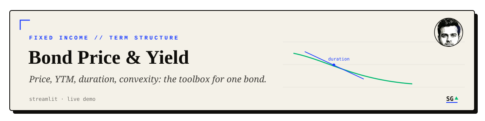

<div align="center">

<br/>


<br/>
<sub><a href="#what-it-does">What it does</a> · <a href="#demo">Demo</a> · <a href="#install-and-run">Install and run</a> · <a href="#concepts">Concepts</a> · <a href="#practical-insights">Practical insights</a> · <a href="#license">License</a></sub>
</div>

---

## What it does

A Streamlit calculator for bond pricing and yield analytics: enter a bond's price, par value, coupon rate, and maturity, and it returns yield to maturity, duration (Macaulay, Modified, or Key Rate), and convexity. Callable bonds add yield to call and callable-specific duration and convexity.

The interactive chart plots the price-yield relationship directly, so the inverse relationship between the two is visible rather than just stated in a table.

Yields are solved with Newton's method (`scipy.optimize.newton`) rather than a closed form, which is what lets the same code path handle both plain and callable bonds.

## Demo

Live app: **[bond-calculator.streamlit.app](https://bond-calculator.streamlit.app/)**

Hosted on Streamlit Community Cloud's free tier, so it sleeps after a period of inactivity. First load shows a "this app has gone to sleep" screen with a one-click wake button; the app is back within about 30 seconds.

## Install and run

```bash
git clone https://github.com/sarthakguptaquant/Fixed-Income-Yield-Pricing.git
cd Fixed-Income-Yield-Pricing
pip install -r requirements.txt
streamlit run Project_Code.py
```

Opens at `localhost:8501`. A `.devcontainer/devcontainer.json` is included for GitHub Codespaces.

### Using the calculator

1. Enter the bond's price, par value, coupon rate, and other details.
2. Click Calculate. YTM (and YTC, if the bond is callable) are computed from your inputs.
3. Read the chart: it shows how price and yield relate, and updates with your inputs.
4. Read the table: coupon payment, number of periods, accrued interest, total cost, YTM, duration, and convexity, plus YTC, callable duration, and callable convexity for callable bonds.

<a id="concepts"></a>
<details>
<summary><strong>Concept glossary: YTM, YTC, duration, convexity</strong></summary>

- **Inverse relationship**: bond prices and yields move in opposite directions. When a bond's price rises, its yield falls, and vice versa.
- **Yield to Maturity (YTM)**: the total return expected on a bond if held to maturity, accounting for current market price, par value, coupon rate, and time to maturity.
- **Yield to Call (YTC)**: for callable bonds, the yield assuming the bond is called (redeemed by the issuer) before maturity. Depends on the call price and time to the call date.
- **Yield to Worst (YTW)**: the lowest yield an investor can receive across call and maturity scenarios — the minimum of YTM and YTC.
- **Duration**: the sensitivity of a bond's price to interest rate changes. The calculator supports Macaulay, Modified, and Key Rate duration.
- **Convexity**: the sensitivity of duration itself to interest rate changes — an estimate of how duration shifts as yield moves.

</details>

## Practical insights

- The price-yield relationship is the mechanism behind most bond investment decisions: understanding it is what makes duration and convexity useful rather than abstract.
- Interest rate trends matter because they move both price and yield together; watching rate direction is watching the calculator's two main outputs at once.
- Corporate, municipal, and treasury bonds carry different risk and call profiles — the same YTM on two bonds does not mean the same risk.

## License

[MIT](LICENSE).

---

<div align="center">

<br/>
<sub><a href="https://github.com/sarthakguptaquant">sarthakguptaquant</a> · AI x quantitative finance · <a href="https://sarthakgpt.com">sarthakgpt.com</a></sub>
</div>
